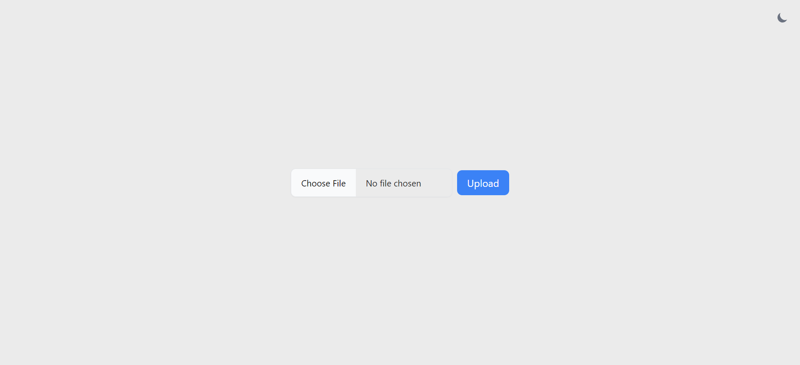

# Overview - Call Insights

Call Insights is a web application that allows users to upload a CSV file, prepocess file and display the results and statistics of the data in the dashboard.

## Tools and Technology used

- PHP
- MySQL
- HTML
- CSS (Tailwind)
- JavaScript
- DataTables
- D3.js

## Setting Up the Project

1. Setup The Database
    - Create a database with a name of your choice (e.g., "call_insight").

2. Setup XAMPP Control Panel.

3. Setup .env file
    - Rename `.env.example` to `.env`.
    - Add the database details to the `.env` file.

## Directory Structure

- `.env`: This file typically contains environment-specific configurations.
- `/api/v1/`: This directory contains the first version of the server-side logic for the application's API.
  - `fetch_table.php`: This file fetches data for a table in the dashboard.
  - `upload.php`: This file handles file uploads.
- `/components/`: This directory contains various components of the application.
  - `/dashboard/`: This directory contains files related to the dashboard.
     - `display_tables.php`: This file generates the HTML for displaying tables in the dashboard.
     - `grid_stats.php`: This file generates statistical data for the dashboard.
     - `grid_viz.php`: This file generates visualizations for the dashboard.
  - `/form/`: This directory contains files related to forms in the application.
     - `displaytable.php`: This file displays a table in a form.
     - `form.php`: This file contains the logic for handling form submissions.
     - `message_area.php`: This file displays dashboard_button when data is successfully stored in the database.
  - `/mode/`: This directory contains `mode.php`, which handles different themes of the application.
- `dashbord.php`: This file likely serves as the main entry point for the dashboard.
- `index.php`: This file is typically the main entry point of a PHP application.
- `/src/`: This directory contains the source files for the client-side of the application.

## Working

### Architecture

### Forms

1. User uploads a CSV file to the form.
2. The form handles the file upload, parses the CSV file, and displays the raw CSV data in a table where users can see the contents of the file.
3. A POST request is made to the backend.
4. If the POST request is successful, the following steps are taken:
    - The data is normalized.
    - The data is saved to the database.
    - A success message is sent to the frontend, and a success alert is displayed, followed by showing the button of the Dashboard.
5. If there is an error in the POST request, the following steps are taken:
    - The request fails.
    - A failed message is sent to the frontend, and a fail alert is displayed.
6. Security measures are also handled to prevent attacks:
    - Input validation is done to prevent uploading of unwanted files.
    - Error handling is done if something is failing.
    - Data encoding is done.
    - Sanitization is done in the backend to remove potentially dangerous characters.

### Dashboard

1. Table query is handled on the server-side.
2. Stats and Visualization are handled by POST requests containing all the data, and a few use cases are considered to showcase the insights of the data based on the following intuitive questions:
    - For Stats:
      - What is the total number of calls made?
      - What is the average, maximum, and minimum call durations?
      - How many calls are answered, not answered, and failed?
      - How many calls were made via SIP and locally?
    - For Visualization:
      - What are the call volumes per day, per month, and year?
      - What is the call disposition?
      - Top 10 Call Count by Top Caller/Recipient.
      - Distribution of Call Channels.

## Results 

### Index Page

### Dashbord Page

